# Exploring FORTH: A Unique Language and Its Functionalities

Forth is a programming language that operates through a virtual machine known as the Forth-VM. This virtual machine is made up of two main components: the interpreter and the dictionary.

The interpreter in Forth is divided into two parts: the "inner interpreter" and the "outer interpreter". These interpreters process lists of commands, which are stored in the dictionary.

The dictionary in Forth is a memory storage area where commands, also known as records, are kept. Each record has three main fields: a link field, a name field, and a code field. Some records may also have an optional parameter field. The link and name fields help the interpreter to find a command in the dictionary, while the code field holds the executable code that carries out the function of the command.

Commands in Forth have two forms: an external form which is the ASCII name of the command, and an internal form which is a token that triggers the executable code stored in the code field. The token is often an address, but it can take other forms depending on the implementation needs.

Forth commands can be categorized into two types: "primitive" commands that contain machine code, and "compound" commands that contain lists of tokens in their code fields.

The Forth interpreter processes two types of lists: text lists and token lists. Text lists are sequences of Forth command names or "words", separated by white spaces and ended with a carriage return. Token lists, on the other hand, are sequences of tokens, which are the internal representations of Forth commands.

The text interpreter, also known as the "outer interpreter", processes lists of Forth commands represented in text. The token interpreter, also known as the "inner interpreter", processes lists of tokens contained in compound commands.

The text interpreter can operate in two modes: interpreting mode and compiling mode. In interpreting mode, a list of command names is interpreted, meaning the commands are parsed and executed. In compiling mode, a list of command names is compiled, meaning the commands are parsed and the corresponding tokens are compiled into a token list. This token list can then be given a name to form a new compound command, by creating a new command record in the dictionary.

The Forth compiler is part of the Forth-VM text interpreter operating in compiling mode. It compiles new compound commands, converting a text list of Forth commands into an equivalent token list. It builds nested token lists one on top of the other, until a final solution is reached in the last token list.

Herein lies the core of FORTH's power - its compiler. Forth is a FORTH Language Text Compiler that operates in compiling mode. Its purpose is to compile new compound commands, converting a text list of FORTH commands into an equivalent token list. It works by constructing nested token lists one atop another until the final solution is reached in the last token list. This robust process characterizes FORTH's flexibility and efficiency, truly distinguishing it as a unique and powerful programming language.
